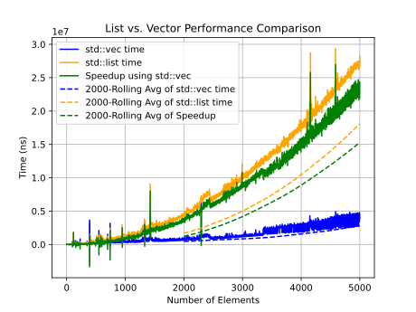

<!-- Write an explanation of why your results are the way they are – this write-up is essential, do not just send code and a graph. -->

# List vs. Vector

Noam Bechhofer  
Design Using C++, Fall 2023, Prof. Stroustrup

## Executive Summary

The purpose of this experiment was to compare the performance of the `std::list` and `std::vector` containers in C++. The experiment was conducted by creating a program that would insert a large number of elements into a container, and then remove them randomly. The program was run multiple times, and the average time was recorded. The results of the experiment showed that the `std::vector` container was faster than the `std::list` container.

## Results

As can be seen in the graph above, `std::vector` is consistently faster than `std::list`. `std::list` also grows at a much faster rate than `std::vector` in relation to the number of elements inserted and removed.

## Analysis

Traditional wisdom says that when removing elements from the middle of a sequence, you should reach for a linked list. The idea goes like this: When you remove an element from the middle of a vector, you need to shunt all following (or preceding depending on implementation) elements over one space. We're told this is an O(n) operation. On the other hand, removing an element form a linked list is an O(1) operations - just redirect a pointer or two, and you're good.  
Traditional wisdom does not explain the results above, which is what makes this such an important experiment. While many programmers would immediately reach for a list given the constraints (knowing we're going to be removing from the middle), the results of this experiment show that a vector is actually faster.  
One confounding factor (though not the primary one) is cache locality. A vector is a contiguous block of memory, while a list is a bunch of scattered nodes. This means that a vector is more likely to be in the cache, and thus faster to access. However, if this were the whole story, we would expect to see some point where the linear cost of shunting all the elements over exceeds the constant time of a memory access. This is not the case.  
The primary issue is that to remove a node from the middle of a linked list we need to traverse the list node-by-node to just find the element. This is an O(n) operation, so even from a theoretical standpoint, we've already balanced out the cost of shunting elements over. And, as we can see from the graph. Combine this with vector's caching speedup, and we get the results we see above.

## Takeway for Developers

### direct takeaway

- importance of measuring performance
  - if you're going to venture off and be clever, you need to measure performance
    - it would be easy to assume that a list is faster, but it's not
      - this should convince us to default to vector
    - more generally, we should be **skeptical programmers** (we'll get to it in a second)
  - so should I not go venture off?
    - no, you should, but you should use the strategy of measuring performance

### being a skeptical programmer

1. don't make performance assertions without measuring them
2. get your system off the ground before optimizing
3. write your code modularly so it can be optimized and refactored **when the time comes**
4. choose your abstractions wisely
   - corrolary: if you can't figure out which abstraction to use, don't abstract yet
5. when the time to optimize does come, test your assumptions using profiling tools
   - don't waste your time optimizing the minor stuff. profiling might reveal bottlenecks you didn't expect that are more significant than ones you did expect.

## Addendum: globals vs. locals
